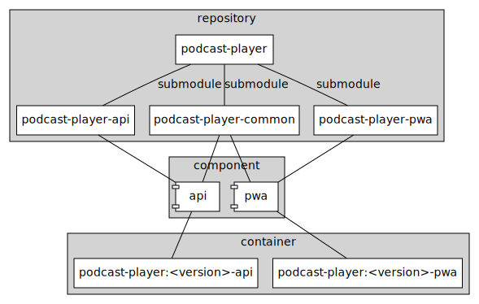
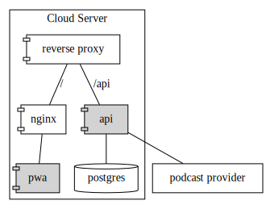

# Podcast Player

A simple offline-first app for listening to podcasts.

## Components

Since podcast feeds can - in general - not be accessed directly from a web application, a backend component was implemented.
The objects shared between the frontend and backend are maintained in a "common" repository.
Hence, there are three repositories (api, pwa, common), which are submodules to this repository.
From these repositories, the three components (api, pwa, updater) are created using GitHub actions.
For each component, a Docker container is created and tagged with the version number and component type.

Each repository is individually versioned (i.e., the version numbers of the components are not the same).
However, the Docker containers are tagged with the overall version number (i.e., the tag of podcast-player repository).

## Deployment

The system can be deployed on a cloud server or any other solution that supports containers.
An example deployment can be seen below.
The components provided by this repository are indicated in grey.

## License

This work is licensed under the MIT license.

`SPDX-License-Identifier: MIT`
